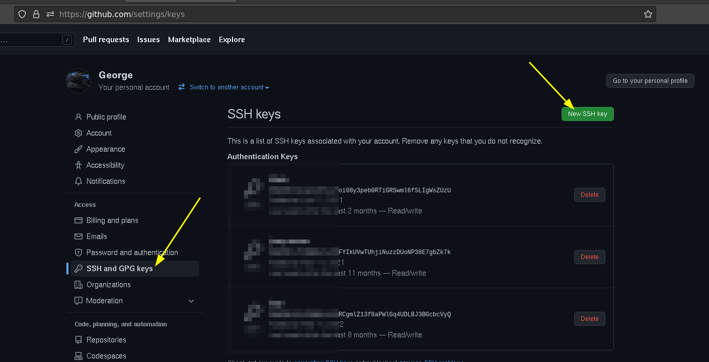

---
## Front matter
title: "ОТЧЕТ по лабораторной работе №2 «Система контроля версий Git» дисциплина:	Архитектура компьютера"
subtitle: "РОССИЙСКИЙ УНИВЕРСИТЕТ ДРУЖБЫ НАРОДОВ. Факультет физико-математических и естественных наук. Кафедра прикладной информатики и теории вероятностей"

author: "Осокин Георгий Иванович, НММбд-02-22 "

## Generic otions
lang: ru-RU
toc-title: "Содержание"

## Bibliography
bibliography: bib/cite.bib
csl: pandoc/csl/gost-r-7-0-5-2008-numeric.csl

## Pdf output format
toc: true # Table of contents
toc-depth: 2
lof: true # List of figures
lot: true # List of tables
fontsize: 12pt
linestretch: 1.5
papersize: a4
documentclass: scrreprt
## I18n polyglossia
polyglossia-lang:
  name: russian
  options:
	- spelling=modern
	- babelshorthands=true
polyglossia-otherlangs:
  name: english
## I18n babel
babel-lang: russian
babel-otherlangs: english
## Fonts
mainfont: PT Serif
romanfont: PT Serif
sansfont: PT Sans
monofont: PT Mono
mainfontoptions: Ligatures=TeX
romanfontoptions: Ligatures=TeX
sansfontoptions: Ligatures=TeX,Scale=MatchLowercase
monofontoptions: Scale=MatchLowercase,Scale=0.9
## Biblatex
biblatex: true
biblio-style: "gost-numeric"
biblatexoptions:
  - parentracker=true
  - backend=biber
  - hyperref=auto
  - language=auto
  - autolang=other*
  - citestyle=gost-numeric
## Pandoc-crossref LaTeX customization
figureTitle: "Рис."
tableTitle: "Таблица"
listingTitle: "Листинг"
lofTitle: "Список иллюстраций"
lotTitle: "Список таблиц"
lolTitle: "Листинги"
## Misc options
indent: true
header-includes:
  - \usepackage{indentfirst}
  - \usepackage{float} # keep figures where there are in the text
  - \floatplacement{figure}{H} # keep figures where there are in the text
---

# Цель работы
##  Ознакомиться с системой контроля версий GIT
##  Создать рабочее окружение для дальнейших лабораторных работ
##  Изучить идеологию применения средств контроля версий

# Выполнение лабораторной работы

#  Базовая настройка GIT
## Выполним предаврительную конфигурацию GIT

{#fig:001 width=80%}

Мы установили имя пользователя, почту, изменили название ветки по умолчанию и еще несколько параметров

#  Генерация пары SSH ключей
##  Перейдем в директорию ~/.ssh и сгенерируем пару ключей

{#fig:002 width=80%}

Я указал два дополнительных параметра `-t`  (тип) `RSA` и размер ключа `(-b)` в 4096 бит. Первый для того, что бы использовать алгоритм шифрования `RSA`, а второй, для того что бы ключ был большего размера, следовательно более надежным.

#  Добавление публичного ключа в аккаунт на GitHub

{#fig:003 width=80%}
 
##  Скопируем публичный ключ коммандой:
##  Перейдем во вкладку SSH and GPG keys на Github, и нажмем New SSH key

{#fig:004 width=80%}

##  Добавим публичный ключ
 
 
{#fig:005 width=80%}

##  Проверим, распознает ли нас GitHub по нашему ключу

{#fig:006 width=80%}

 Так имя пользователя на Github — **Horhik**, а не **giosokin**, В сообщении «Hi Horhik!» Но так как мы изменили имя пользователя, когда конфигурировали GIT — комиты на гитхабе будут отображаться от имени **giosokin**
#  Создадим рабочее пространство со следующией файловой иерархией

{#fig:007 width=80%}

#  Создадим новый репозиторий из шаблона

{#fig:008 width=80%}

# Склонируем репозиторий на свой компьютера

{#fig:009 width=80%}

Репозиторий склонировался на локальную машину

#  Перейдем в каталог с репозитоиием и просмотрим его содержимое

{#fig:010 width=80%}

#  Удалим файл `package.json` и создадим файл `COURSE` содержащий текст *«arch-pc»*
 
 
{#fig:011 width=80%}
 
##  Исполним команду make что бы выполнить команды из `Makefile`

{#fig:012 width=80%}

##  Отправим файлы на сервер. Добавим изменения коммандой git add, закоммитим их и отправим на сервер
  
  
{#fig:013 width=80%}

{#fig:014 width=80%}
  
##  Перейдем на [https://github.com/Horhik/study_2022-2023_arh-pc/commits/master](https://github.com/Horhik/study_2022-2023_arh-pc/commits/master) что бы посмотреть, список коммитов
 
 
{#fig:015 width=80%}
 
# Задания для самостоятельной работы

##  Добавим отчет по выполнению лабораторной работы в каталог рабочего пространства.
 
{#fig:016 width=80%}

Так как изначально отчет хранился в домашней директории другого пользователя, я перешел под пользователя root (коммандой `su root`) и перекопировал файл в каталог для отчета. 

##  Скопируем отчеты о предыдущих лабораторных работах в рабочее пространство

{#fig:017 width=80%}

Предыдущие отчеты представляют собой один `pdf` и  `odt` файл. Они были перекопированы в соответствующие директории в локальном репозитории

##  Сохраним изменения и закоммитим

###  Переключим пользователя и зайдем в локальный репозиторий

{#fig:018 width=80%}

###  Исполним комадну git add . И посмотрим, какие изменения будут закоммичены
 
 
{#fig:019 width=80%}
 
###  Закоммитим изменения
 
 
 
{#fig:020 width=80%}

### Запушим изменения 
 

Данные изменения можно посмотреть на гитхабе [по ссылке](https://github.com/Horhik/study_2022-2023_arh-pc/commit/b9284bd35e3af7f57efd5f17f9c952db9c2b8a71)
 
 
{#fig:021 width=80%}

{#fig:022 width=80%}
 
Заметим, что Initial Commit сделан пользователем Horhik, но последующие созданы пользователем giosokin, так как мы создали репозиторий из шаблона, через Web-интерфейс, а изменения выгружали   со своего компьютера, на котором задали имя пользователя giosokin

{#fig:023 width=80%}

# Выводы
В ходе лабораторной работы мы ознакомились с системой контроля версий GIT, узнали разницу между централизованным VCS и распределенными (такими как GIT), Создали репозиторий из шаблонана сервисе GitHub и внесли в него некоторые изменения. Мы освоили базовые команды утилиты git и создали рабочее пространство для следующих лабораторных работ.

# Список литературы{.unnumbered}

::: {#refs}
:::
