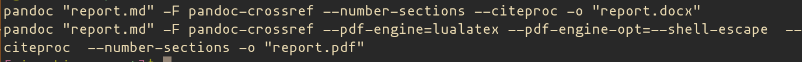

---
## Front matter
title: "Лабоаторная работа №4. Язык Markdown"
subtitle: "Дисциплина - Архитектура Компьютера"
author: "Осокин Георгий Иванович. НММбд-02-22"

## Generic otions
lang: ru-RU
toc-title: "Содержание"

## Bibliography
bibliography: bib/cite.bib
csl: pandoc/csl/gost-r-7-0-5-2008-numeric.csl

## Pdf output format
toc: true # Table of contents
toc-depth: 2
lof: true # List of figures
lot: true # List of tables
fontsize: 12pt
linestretch: 1.5
papersize: a4
documentclass: scrreprt
## I18n polyglossia
polyglossia-lang:
  name: russian
  options:
	- spelling=modern
	- babelshorthands=true
polyglossia-otherlangs:
  name: english
## I18n babel
babel-lang: russian
babel-otherlangs: english
## Fonts
mainfont: PT Serif
romanfont: PT Serif
sansfont: PT Sans
monofont: PT Mono
mainfontoptions: Ligatures=TeX
romanfontoptions: Ligatures=TeX
sansfontoptions: Ligatures=TeX,Scale=MatchLowercase
monofontoptions: Scale=MatchLowercase,Scale=0.9
## Biblatex
biblatex: true
biblio-style: "gost-numeric"
biblatexoptions:
  - parentracker=true
  - backend=biber
  - hyperref=auto
  - language=auto
  - autolang=other*
  - citestyle=gost-numeric
## Pandoc-crossref LaTeX customization
figureTitle: "Рис."
tableTitle: "Таблица"
listingTitle: "Листинг"
lofTitle: "Список иллюстраций"
lotTitle: "Список таблиц"
lolTitle: "Листинги"
## Misc options
indent: true
header-includes:
  - \usepackage{indentfirst}
  - \usepackage{float} # keep figures where there are in the text
  - \floatplacement{figure}{H} # keep figures where there are in the text
---

# Цель работы

## Освоение процедуры оформления лабораторных работ с помощью языка разметки Markdown.

# Выполнение лабораторной работы

## Откроем терминал и перейдем в каталог созданный во время выполнения 3й лабораторной

{#fig:001 width=70%}

## Обновим локальной репозиторий командой `git pull`
{#fig:002 width=70%}

## Перейдем в каталог с 4 лабораторной 
исполним `make` чтобы выполнить комманды из Makefile

{#fig:003 width=70%}

## Проверим сгенерированные файлы
	Откроем сгенерированные `report.md` и `report.pdf`

{#fig:004 width=70%}

Я отрыл pdf через утилиту **Zathura** и .docx через **LibreOffice**

{#fig:005 width=70%}

## Удалим полученные файлы
исполним комманду `make clean`
Убедимся, что файлы удалены с помощью `ls`

{#fig:006 width=70%}

## Откроем `report.md` с помощью текстового редактора
В моем случае - это текстовый редактор **Emacs**. Изучим структуру файла.
В начале .md файла (межд `---` ) видим множество заголовков с параметрами, в формате **YAML**

{#fig:007 width=70%}

В ней указывается шрифт, язык документа, заголовок, автор и т.п.
Внесем некоторые изменения и скомпилируем отчет.

{#fig:008 width=70%}

## Скомпилируем отчет 
Исполник комманду `make`.

{#fig:009 width=70%}

Откроем сгенерированный  .pdf   файл через  **Zathura**. 

{#fig:010 width=70%}

## Загрузим Файлы на GitHub

Исполним комманды `git add`, `git commit` и `git push`

{#fig:011 width=70%}

# Задания для самостоятельной работы
## Сделать отчет по 3й лабораторной работе
### Отдельно сохраним фотографии из лабораторной
Откроем содержимое .odt файла третьей лабораторной и скопируем содержимое папки `./Pictures` в директорию `./image` третьей лабораторной. 

{#fig:012 width=70%}

{#fig:013 width=70%}

Теперь переименуем все файлы в `1.png`, `2.png`, `3.png` и т.д. ...

{#fig:014 width=70%}

### Перекопируем текст в .md файл
Откроем файл с третьей лабораторной в libreoffice и скопируем все содержимое в report.md

{#fig:015 width=70%}

### Оформим третью лабораторную
Оформим лабораторную работу в markdown, вставляя картинки 

{#fig:016 width=70%}

Сконвертируем в `pdf` и `docx` коммандой make

{#fig:017 width=70%}

## Загрузить отчет 3 и 4 на GitHub

Закоммитим изменения третьей лабораторной 

{#fig:018 width=70%}

Закоммитим четвертую лабораторную

# Выводы

В ходе данной лабораторной работы, мы освоили язык разметки Markdown, пересоздали отчет по третьей лабораторной работе в Markdown и научились конвертировать созданные `.md` файлы в `pdf` и `docx` с помощью texlive, pandoc и утилиты make.

# Список литературы{.unnumbered}

::: {#refs}
:::
