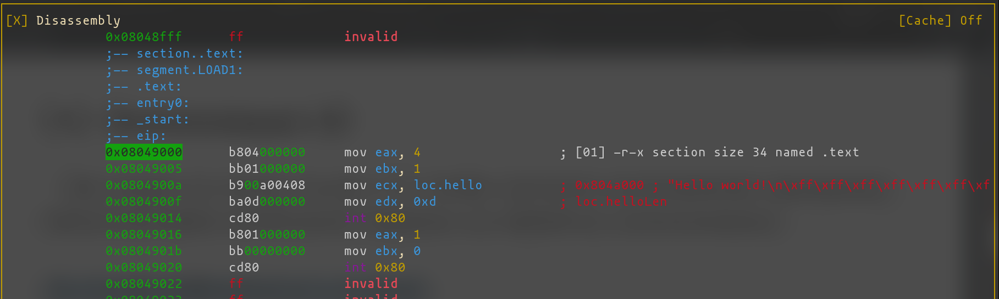
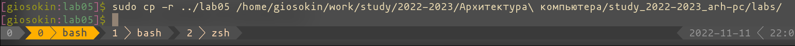

---
## Front matter
title: "Лабораторная работа №5 Создание и процесс обработки программ на языке ассемблера NASM"
subtitle: "Факультет физико-математических и естественных наук Кафедра прикладной информатики и теории вероятностей. Дисциплина: Архитектура ЭВМ"
author: "Осокин Геогий Иванович. НММбд-02-22"

## Generic otions
lang: ru-RU
toc-title: "Содержание"

## Bibliography
bibliography: bib/cite.bib
csl: pandoc/csl/gost-r-7-0-5-2008-numeric.csl

## Pdf output format
toc: true # Table of contents
toc-depth: 2
lof: true # List of figures
lot: true # List of tables
fontsize: 12pt
linestretch: 1.5
papersize: a4
documentclass: scrreprt
## I18n polyglossia
polyglossia-lang:
  name: russian
  options:
	- spelling=modern
	- babelshorthands=true
polyglossia-otherlangs:
  name: english
## I18n babel
babel-lang: russian
babel-otherlangs: english
## Fonts
mainfont: PT Serif
romanfont: PT Serif
sansfont: PT Sans
monofont: PT Mono
mainfontoptions: Ligatures=TeX
romanfontoptions: Ligatures=TeX
sansfontoptions: Ligatures=TeX,Scale=MatchLowercase
monofontoptions: Scale=MatchLowercase,Scale=0.9
## Biblatex
biblatex: true
biblio-style: "gost-numeric"
biblatexoptions:
  - parentracker=true
  - backend=biber
  - hyperref=auto
  - language=auto
  - autolang=other*
  - citestyle=gost-numeric
## Pandoc-crossref LaTeX customization
figureTitle: "Рис."
tableTitle: "Таблица"
listingTitle: "Листинг"
lofTitle: "Список иллюстраций"
lotTitle: "Список таблиц"
lolTitle: "Листинги"
## Misc options
indent: true
header-includes:
  - \usepackage{indentfirst}
  - \usepackage{float} # keep figures where there are in the text
  - \floatplacement{figure}{H} # keep figures where there are in the text
---

# Цель работы
	
	Освоенить процедуры компиляции и сборки программ, написанных на ассемблере NASM.
	
# Выполнение лабораторной работы

## Программа "Hello world"
### Создадим файл `hello.asm`

Перейдем в директорию lab05

{ #fig:001 width=70% }

Создадим фалй `lab05.asm` и откроем его в текстовом редакторе *Emacs*

{ #fig:002 width=70% }

{ #fig:003 width=70% }

Введем исходный текст в файл

{ #fig:004 width=70% }

### Воспользуемся транслятором NASM

Странслируем исходный код в объектный файл с помощью комманды `nasm -f elf hello.asm`

{ #fig:005 width=70% }

Создадим объектный файл с другим именем, с помощью опции `-o` и сгенерируем листинг, с помощью опции `-l`

{ #fig:006 width=70% }

### Слинкуем `obj.o` спомощью утилиты `ld`

Исполним комманду `ld -m elf_i386 hello.o -o hello` , что б получить исполняемый файл `hello`

{ #fig:007 width=70% }

### Откроем исполняемый файл через дизассемблер

Мы получили исполняемый файл. Из любопытства, откроем его через дизасемблер *Radare2*

{ #fig:008 width=70% }

Заметим, что код на ассемблере представленный здесь, очень похож на наш изначальный и даже сохронились названия некоторый "переменных" 

### Слинкуем в файл с другим именем с помощью опции `-o`

{ #fig:009 width=70% }

### Удалим лишние файлы

{ #fig:010 width=70% }

### Запустим исполняемый файл

Наберем в консоли `./main` и увидем вывод.

{ #fig:011 width=70% }

## Задания для самостоятельной работы

### Создадим файл `lab05.asm`

{ #fig:012 width=70% }

Скопируем исходный код из `hello.asm` и модифицируем его через текстовый редактор *Emacs*

{ #fig:013 width=70% }

### Странслируем в объектный файл  `obj-lab05.o`

Воспользуемся транслятором NASM что бы получить объектный файл

{ #fig:014 width=70% }

### Создадим исполняемый файл с помощью `ld`

{ #fig:015 width=70% }

### Запустим `./lab05`

{ #fig:016 width=70% }

Как видим, в консоль выводится строка, которую мы задали (фамилия с именем)

## Скопируем папку в рабочее пространство  и отправим на GitHub

{ #fig:017 width=70% }

Создадим коммит с сообщением **"start lab05"** и запушим. 

{ #fig:018 width=70% }

# Выводы

В ходе данной лабораторной работы мы научились переводить программы на языке ассемблера NASM в исполняемый файл с помощью трансляции и последуюещей линковки.
Мы написали программу на NASM, которая ввыводит в консоль нашу фамилию и имя. А также проверили,  что в исполняемом файле в дизасемблированном виде находится очень похожий на наш изначальный код на языке ассемблера. 

