---
## Front matter
title: " Лабораторная работа №6. Основы работы с Midnight Commander (mc). Структура программы на языке ассемблера NASM."
subtitle: "Дисциплина: Архитектура ЭВИ"
author: "Осокин Георгий Иванович НММбд-02-22"

## Generic otions
lang: ru-RU
toc-title: "Содержание"

## Bibliography
bibliography: bib/cite.bib
csl: pandoc/csl/gost-r-7-0-5-2008-numeric.csl

## Pdf output format
toc: true # Table of contents
toc-depth: 2
lof: true # List of figures
lot: true # List of tables
fontsize: 12pt
linestretch: 1.5
papersize: a4
documentclass: scrreprt
## I18n polyglossia
polyglossia-lang:
  name: russian
  options:
	- spelling=modern
	- babelshorthands=true
polyglossia-otherlangs:
  name: english
## I18n babel
babel-lang: russian
babel-otherlangs: english
## Fonts
mainfont: PT Serif
romanfont: PT Serif
sansfont: PT Sans
monofont: PT Mono
mainfontoptions: Ligatures=TeX
romanfontoptions: Ligatures=TeX
sansfontoptions: Ligatures=TeX,Scale=MatchLowercase
monofontoptions: Scale=MatchLowercase,Scale=0.9
## Biblatex
biblatex: true
biblio-style: "gost-numeric"
biblatexoptions:
  - parentracker=true
  - backend=biber
  - hyperref=auto
  - language=auto
  - autolang=other*
  - citestyle=gost-numeric
## Pandoc-crossref LaTeX customization
figureTitle: "Рис."
tableTitle: "Таблица"
listingTitle: "Листинг"
lofTitle: "Список иллюстраций"
lotTitle: "Список таблиц"
lolTitle: "Листинги"
## Misc options
indent: true
header-includes:
  - \usepackage{indentfirst}
  - \usepackage{float} # keep figures where there are in the text
  - \floatplacement{figure}{H} # keep figures where there are in the text
---

# Цель работы
Приобретение практических навыков работы в Midnight Commander. Освоение

# Выполнение лабораторной работы

## Откроем через терминал MidnightCommander

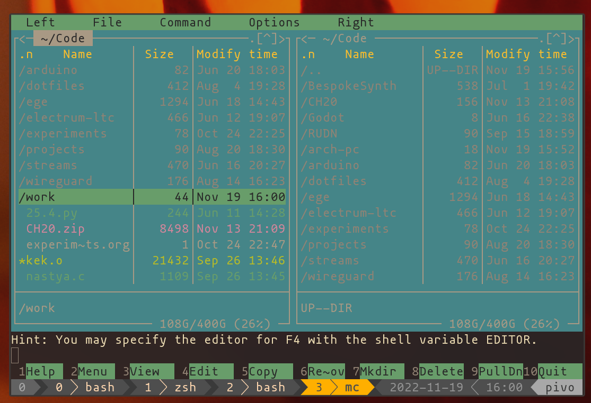{ #fig:001 width=70% }

Перейдем в каталог `./work/arch-pc` и создадим папку `./lab06`

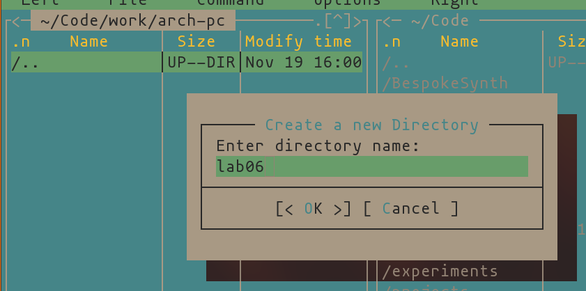{ #fig:002 width=70% }

Наберем в строке ввода `touch lab6.asm`

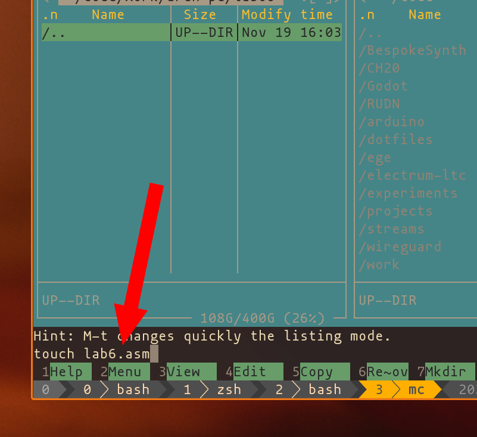{ #fig:003 width=70% }

## Для своего удобства я изменю текстовый редактор по умолчанию на VIM

Зайдем в настройки, нажав `F9`, `o`, `c`

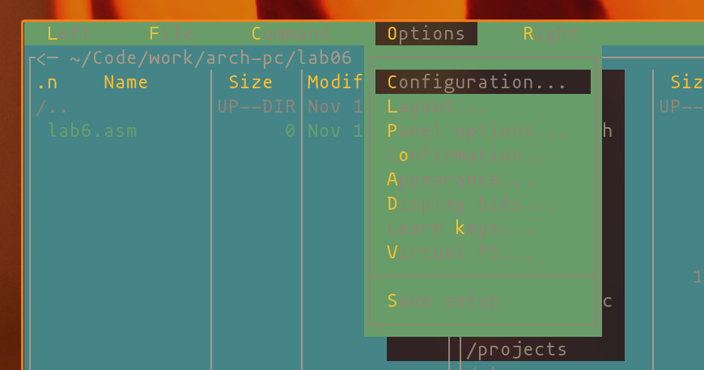{ #fig:004 width=70% }

Нажмем `t` что бы снять галочку с "Use internal edit"

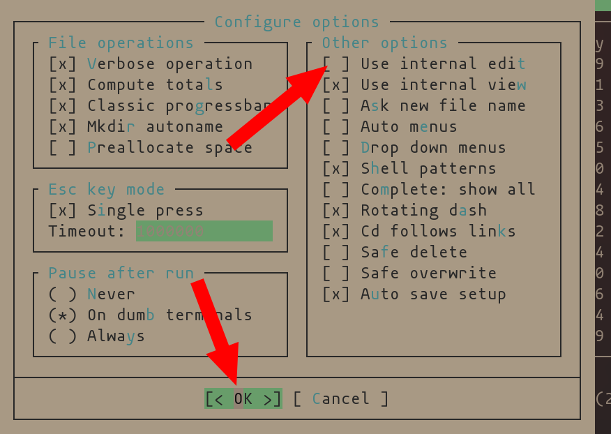{ #fig:005 width=70% }

Теперь, когда мы нажимаем `F4` в MC, открывается текстовый редактор VIM

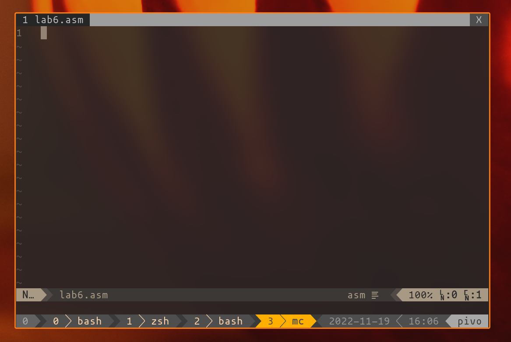{ #fig:006 width=70% }

## Введем текст программы из листинга

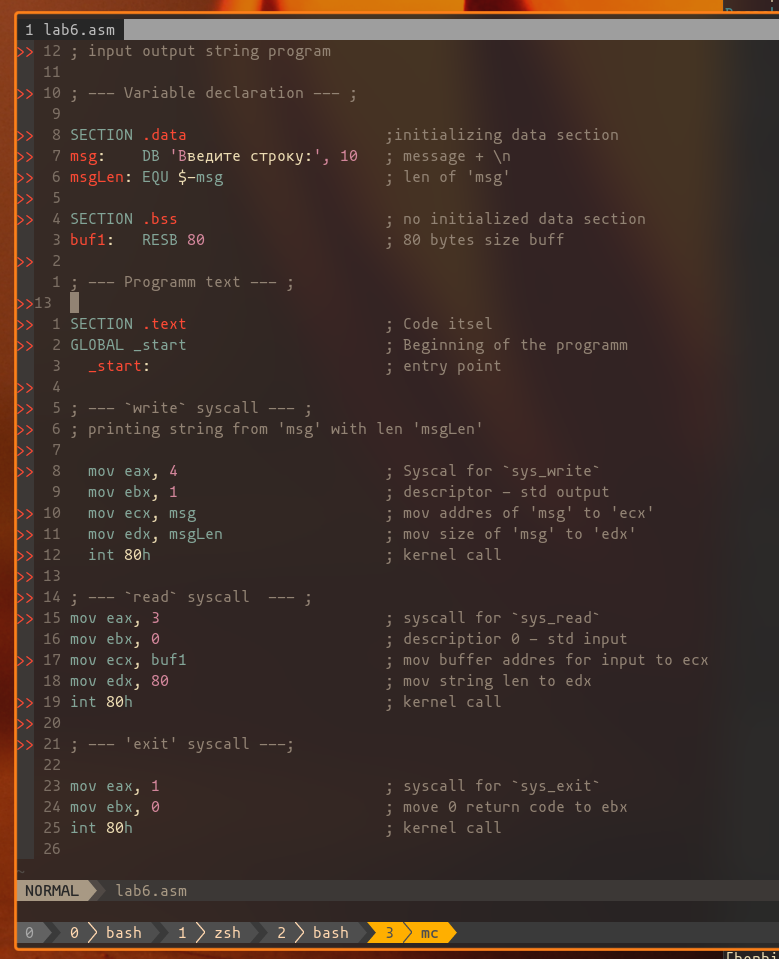{ #fig:007 width=70% }

Просмотрим содержимое измененного и сохраненного файла через MC, нажав `F3`

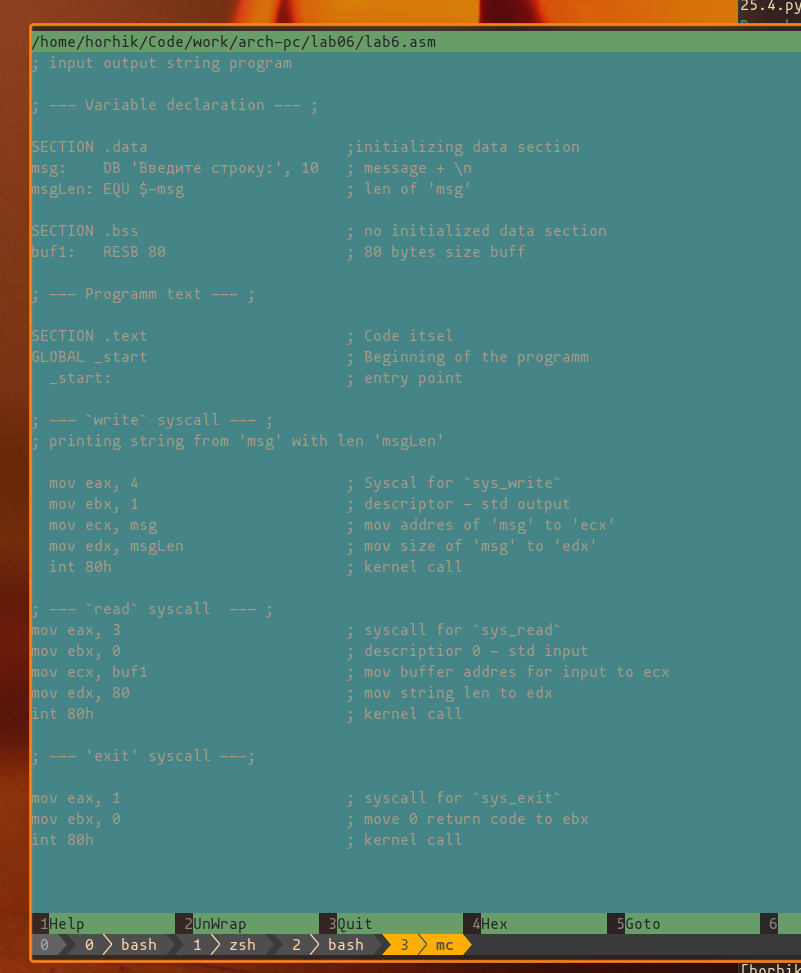{ #fig:008 width=70% }

Оттранслируем, слинкуем файл `lab6-1.asm` (переместив lab6 в lab6-1).
Запустим исполнимый файл.

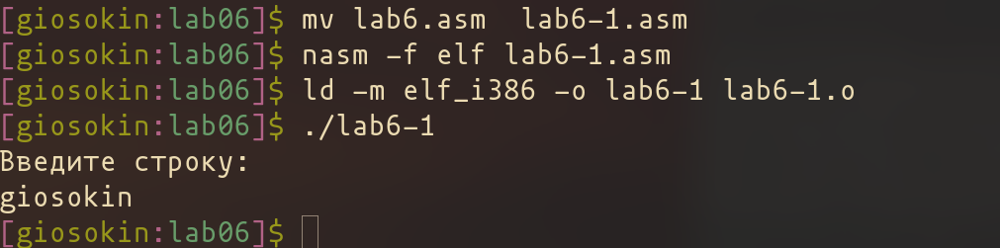{ #fig:009 width=70% }

## Подключим внеший файл

Откроем MC

{ #fig:010 width=70% }

Найдем файл `in_out.asm` в `~/Downloads`

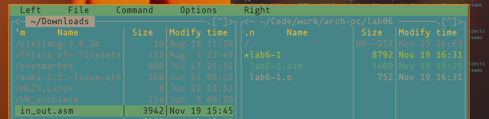{ #fig:011 width=70% }

Скопируем файл в lab5, нажав `F5`

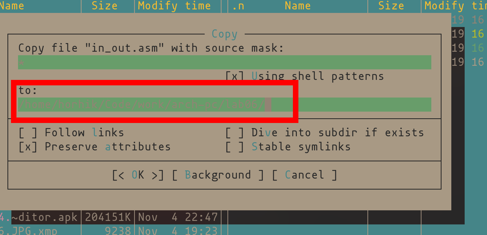{ #fig:012 width=70% }

Как видим, файл появился в директории `lab06`

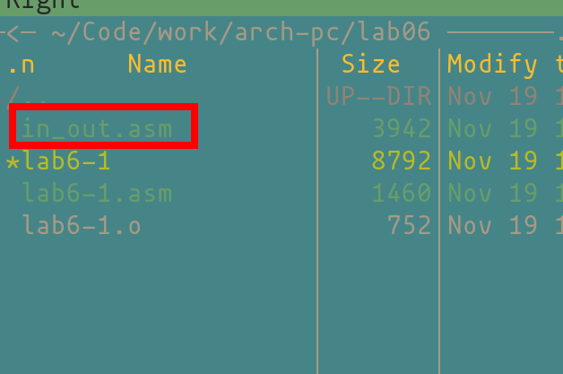{ #fig:013 width=70% }

Скопируем файл в `lab6-2.asm`

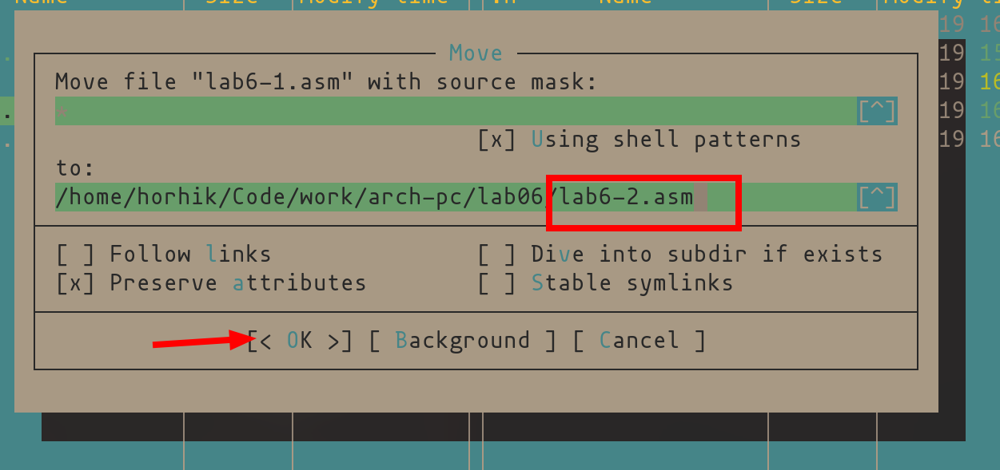{ #fig:014 width=70% }

 Как видим, файл скопировался
 
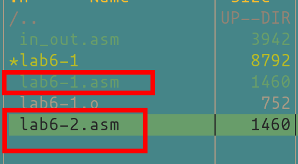{ #fig:015 width=70% }

## Изменим содержимое lab6-2.asm, используя подпрограммы из `in_out.asm`

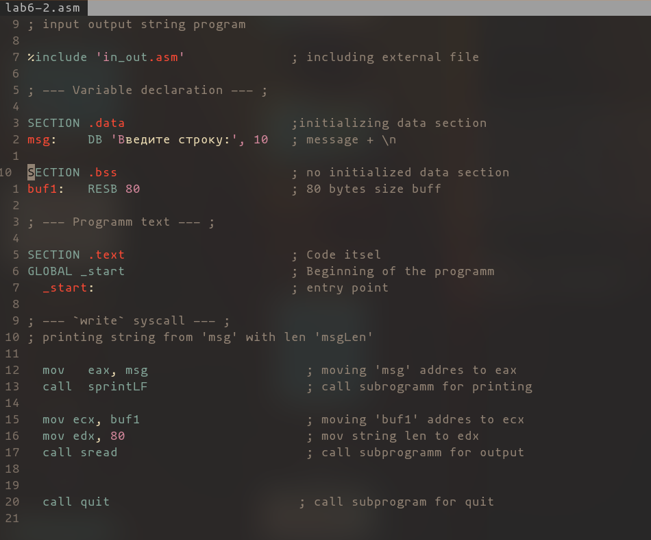{ #fig:016 width=70% }

Создадим копию lab6-2.1.asm

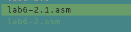{ #fig:017 width=70% }

Заменим `sprintLF` на `sprint`

{ #fig:018 width=70% }

Странслируем, слинкуем и запустим две эти программы

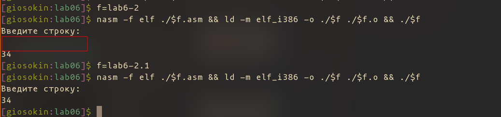{ #fig:019 width=70% }

Как видим, у первой есть перенос строки, у второй он отсутствует

# Задания для самостоятельной работы
 
## Создадим копию `lab-1.asm` с выводом ввода

{ #fig:020 width=70% }

Откроем новый файл и добавим в него блок с выводом строки из `buf1`

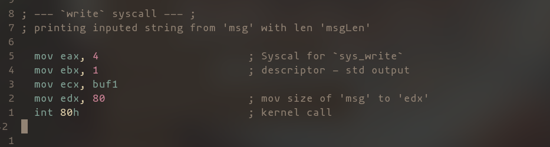{ #fig:021 width=70% }

Скомпилируем и запустим

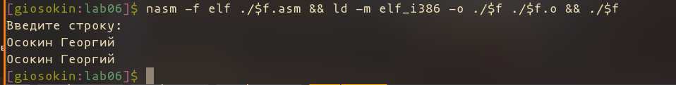{ #fig:022 width=70% }

Заметим, что если заменить `buf1` на `msg+msgLen` то резульат будет таким же.
Так как `buf1` инициализируется в памяти сразу после `msg` и размер `msg` это `msgLen`.
Поэтому, аддрес `msg+msgLen` в точности аддрес `buf1`

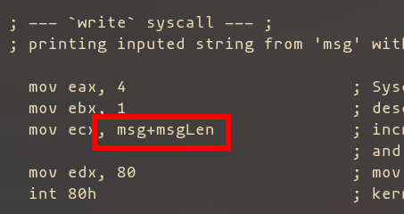{ #fig:0212 width=70% }

Скомпилируя этот файл мы получим такой же результат

{ #fig:023 width=70% }

Отнимем 1 и посмотрим что получится

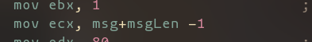{ #fig:024 width=70% }

Исполним

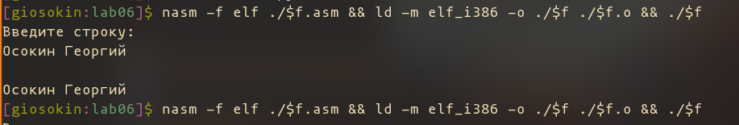{ #fig:025 width=70% }

Мы захватили с собой перенос строки, которым заканчивался текст `msg`

## Создадим копию `lab-2.asm` с выводом ввода

{ #fig:026 width=70% }

Добавим две строчки, первая будет перемещать значение из буфера в  eax
Вторая исполнит подпрограмму вывода

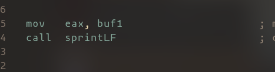{ #fig:027 width=70% }

Скомпилируем и запустим 

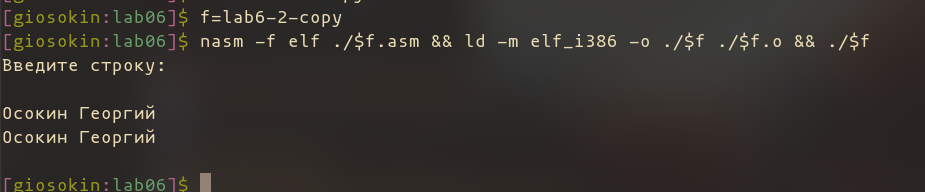{ #fig:028 width=70% }

# Выводы

В ходе данной лабораторной работы мы научились пользоваться Midnight Commander и освоили базовые инструкции языка ассемблера mov и int. 

# Список литературы{.unnumbered}

