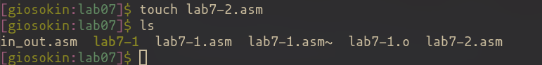

---
## Front matter
title: "Лабораторная работа №7.Арифметические"
subtitle: "Дисциплина Архитектура ЭВМ"
author: "Осокин георгий иванович"

## Generic otions
lang: ru-RU
toc-title: "Содержание"

## Bibliography
bibliography: bib/cite.bib
csl: pandoc/csl/gost-r-7-0-5-2008-numeric.csl

## Pdf output format
toc: true # Table of contents
toc-depth: 2
lof: true # List of figures
lot: true # List of tables
fontsize: 12pt
linestretch: 1.5
papersize: a4
documentclass: scrreprt
## I18n polyglossia
polyglossia-lang:
  name: russian
  options:
	- spelling=modern
	- babelshorthands=true
polyglossia-otherlangs:
  name: english
## I18n babel
babel-lang: russian
babel-otherlangs: english
## Fonts
mainfont: PT Serif
romanfont: PT Serif
sansfont: PT Sans
monofont: PT Mono
mainfontoptions: Ligatures=TeX
romanfontoptions: Ligatures=TeX
sansfontoptions: Ligatures=TeX,Scale=MatchLowercase
monofontoptions: Scale=MatchLowercase,Scale=0.9
## Biblatex
biblatex: true
biblio-style: "gost-numeric"
biblatexoptions:
  - parentracker=true
  - backend=biber
  - hyperref=auto
  - language=auto
  - autolang=other*
  - citestyle=gost-numeric
## Pandoc-crossref LaTeX customization
figureTitle: "Рис."
tableTitle: "Таблица"
listingTitle: "Листинг"
lofTitle: "Список иллюстраций"
lotTitle: "Список таблиц"
lolTitle: "Листинги"
## Misc options
indent: true
header-includes:
  - \usepackage{indentfirst}
  - \usepackage{float} # keep figures where there are in the text
  - \floatplacement{figure}{H} # keep figures where there are in the text
---

# Цель работы

Освоение арифметических инструкций языка ассемблера NASM.

# Выполнение лабораторной работы

Создадим каталог и перейдем в него. Создадим `lab7-1.asm`

{ #fig:001 width=70% }

## Складывание строк

Введем текст листинга в файл 

{ #fig:002 width=70% }

Оттранслируем, слинкуем и запустим

{ #fig:003 width=70% }

Видим, что вывелось "j" потому что мы складываем не числа, а коды строк, и в результате выводим код строки "j"

## Складывание чисел

Заменим строки на числа, скомпилируем и запустим

{ #fig:004 width=70% }

Нам вывелся перенос строки, так как мы хоть и сложили числа, но так же вывели не число 10, а символ которому присвоен код 10, то есть перенос строки 

## Программа вывода значение регистра eax

Создадим фалй lab7-2.asm

{ #fig:005 width=70% }

Введем текст

{ #fig:006 width=70% }

Запустим код

{ #fig:007 width=70% }

Программа вывела 106, так как мы выводим аддрес символа, который мы получаем, суммируя адрессы двух строк

Заменим sprintLF на iprintLF и запустим

{ #fig:008 width=70% }

Вывелось $6+4  = 10$

Заменим iprintLF на iprint

{ #fig:009 width=70% }

Вывелось 10, без перевода строки

## Программа для вычесления выражения $f(x) = (5*2 + 3)/3$

Создадим файл `lab7-3.asm`

{ #fig:010 width=70% }

Запишем текст в файл и запустим. 

{ #fig:011 width=70% }

## Изменение программы для вычисления выражения $f(x) = (4*6 + 2)/5$

Заменим числа и исполним

{ #fig:012 width=70% }

Скомпилируем и запустим

{ #fig:013 width=70% }

## Вычесление варианта по студенческому билеты

Создадим файл `variant.asm` с текстом листинга `7.4` 

{ #fig:014 width=70% }

1. Для вывода на экран "Ваш вариант" отвечают стоки 31-32 (выделены красным)

2. инструкции на строка 19-21 (выделены голубым) используется для ввода текста в `x` из консоли

3. `call atoi` используется для преобразования ACII кода в число 

4. За вычисление варианта отвечают строки 26-29 

5. Остаток от деления записывается в `edx/dx`

6.  `inc edx` увеличивает значение `edx` на 1

7.  За вывод результата вычислений отвечают строки 33-34 (выделенно желтым)

Запустим программу что бы узнать номер варианта

{ #fig:015 width=70% }

Наш варинт 18

# Задания для самостоятельной работы

## Написать программу по вычислению  $3(x+10) - 20$

Напишем, код, который будет вычислять. 

Изменим размер буффера с 80 на 10, так как для чисел 80 байт многовато. 

Так как введенное значение уже в `eax` просто добавим к нему 10, домножим на 3 и отнимем 20

{ #fig:016 width=70% }

Запустим и убедимся в верности выполненных вычислений

{ #fig:017 width=70% }

# Выводы

Мы освоили арифмитические операции в NASM и написали программу, которое вычисляет значение функции от x
