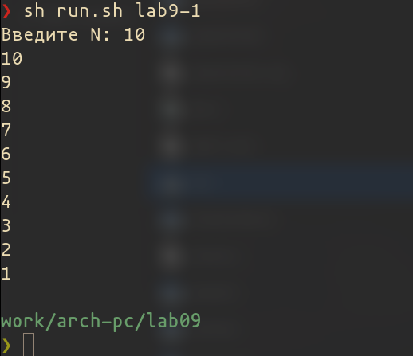
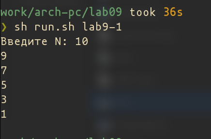
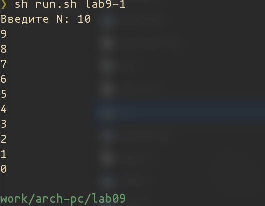
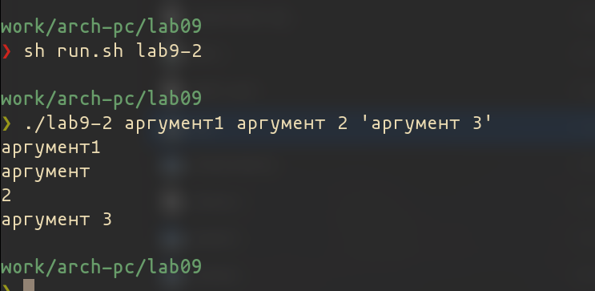
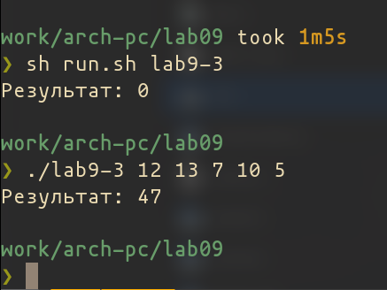
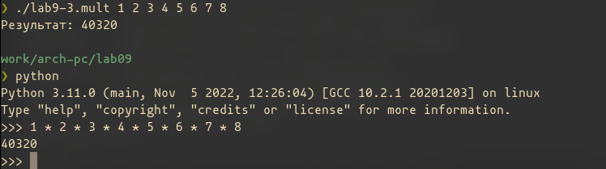
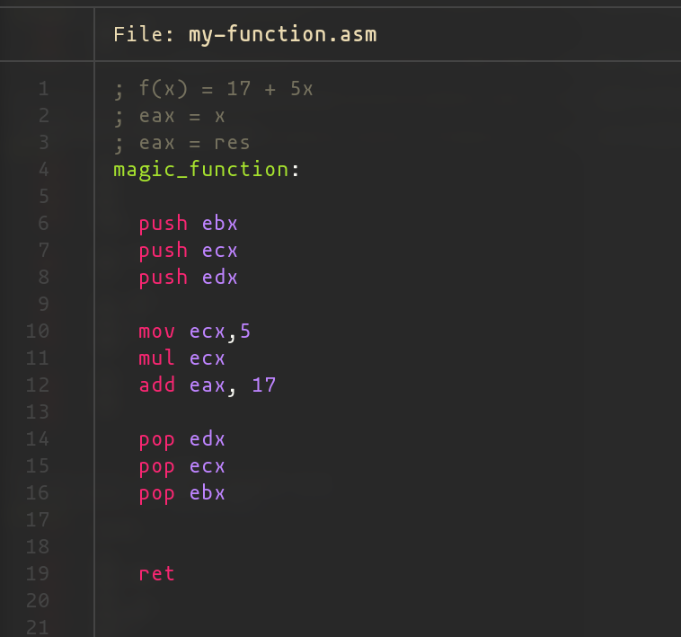
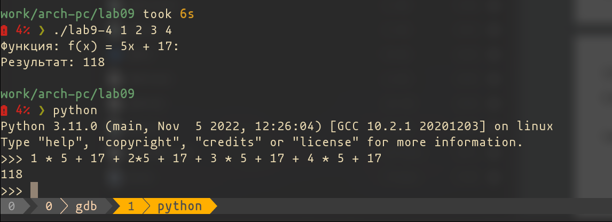

---
## Front matter
title: "Лабораторная работа №9. Программирование цикла. Обработка"
subtitle: "Архитектура ЭВМ"
author: "Осокин Георгий Иванович НММбд-02-22"

## Generic otions
lang: ru-RU
toc-title: "Содержание"

## Bibliography
bibliography: bib/cite.bib
csl: pandoc/csl/gost-r-7-0-5-2008-numeric.csl

## Pdf output format
toc: true # Table of contents
toc-depth: 2
lof: true # List of figures
lot: true # List of tables
fontsize: 12pt
linestretch: 1.5
papersize: a4
documentclass: scrreprt
## I18n polyglossia
polyglossia-lang:
  name: russian
  options:
	- spelling=modern
	- babelshorthands=true
polyglossia-otherlangs:
  name: english
## I18n babel
babel-lang: russian
babel-otherlangs: english
## Fonts
mainfont: PT Serif
romanfont: PT Serif
sansfont: PT Sans
monofont: PT Mono
mainfontoptions: Ligatures=TeX
romanfontoptions: Ligatures=TeX
sansfontoptions: Ligatures=TeX,Scale=MatchLowercase
monofontoptions: Scale=MatchLowercase,Scale=0.9
## Biblatex
biblatex: true
biblio-style: "gost-numeric"
biblatexoptions:
  - parentracker=true
  - backend=biber
  - hyperref=auto
  - language=auto
  - autolang=other*
  - citestyle=gost-numeric
## Pandoc-crossref LaTeX customization
figureTitle: "Рис."
tableTitle: "Таблица"
listingTitle: "Листинг"
lofTitle: "Список иллюстраций"
lotTitle: "Список таблиц"
lolTitle: "Листинги"
## Misc options
indent: true
header-includes:
  - \usepackage{indentfirst}
  - \usepackage{float} # keep figures where there are in the text
  - \floatplacement{figure}{H} # keep figures where there are in the text
---

# Цель работы
Приобретение навыков написания программ с использованием циклов и
обработкой аргументов командной строки.

# Выполнение лабораторной работы

Создадим каталог для выполнения лабораторной, перейдем в него и введем листинг 9.1 в файл

``` asm
%include 'in_out.asm'

SECTION .data

msg1 db 'Введите N: ',0h

SECTION .bss

N: resb 10

SECTION .text

global _start

_start:
; ----- Вывод сообщения 'Введите N: '

  mov eax,msg1
  call sprint

; ----- Ввод 'N'
  mov ecx, N
  mov edx, 10
  call sread

; ----- Преобразование 'N' из символа в число

  mov eax,N
  call atoi
  mov [N],eax
; ------ Организация цикла

  mov ecx,[N] ; Счетчик цикла, `ecx=N`
label:

  mov [N],ecx
  mov eax,[N]
  call iprintLF ; Вывод значения `N`

  loop label ; `ecx=ecx-1` и если `ecx` не '0'
             ; переход на `label`
  call quit

```

Запустим код и введем аргумент

{ #fig:001 width=70% }


Добавим строчку с уменьшением ecx на 1

```nasm
  sub ecx, 1 ; уменьшаем ECX на 1
  mov [N],ecx
  mov eax,[N]
  call iprintLF ; Вывод значения `N`

```


Исполним программу. 

{ #fig:002 width=70% }


Обернем, данную часть кода в push, pop. И теперь посмотрим на результат.


```nasm
  push ecx
  sub ecx, 1
  mov [N],ecx
  mov eax,[N]
  call iprintLF ; Вывод значения `N`
  pop ecx

```


{ #fig:003 width=70% }


## Вывод на экран аргументов коммандной строки

Скопируем в файл `lab9-2.asm` листинг `9.2`

```nasm
%include 'in_out.asm'

SECTION .text
global _start

_start:
  pop ecx ; Извлекаем из стека в `ecx` количество
          ; аргументов (первое значение в стеке)
  pop edx ; Извлекаем из стека в `edx` имя программы
          ; (второе значение в стеке)
  sub ecx, 1 ; Уменьшаем `ecx` на 1 (количество
              ; аргументов без названия программы)
next:
  cmp ecx, 0 ; проверяем, есть ли еще аргументы
  jz _end ; если аргументов нет выходим из цикла
          ; (переход на метку `_end`)
  pop eax ; иначе извлекаем аргумент из стека
  call sprintLF ; вызываем функцию печати
  loop next ; переход к обработке следующего
            ; аргумента (переход на метку `next`)
_end:
  call quit


```

Скомпилируем и запустим файл. 

{ #fig:004 width=70% }

Программа вывела 4 аргумента и вывела соответствующие строки. 

## Программа выводящая сумму аргументов


Скопируем программу из листинга **9.3** в `lab9-3.asm`


```nasm

%include 'in_out.asm'
SECTION .data
msg db "Результат: ",0
SECTION .text
global _start
_start:
  pop ecx ; Извлекаем из стека в `ecx` количество
         ; аргументов (первое значение в стеке)
  pop edx ; Извлекаем из стека в `edx` имя программы
          ; (второе значение в стеке)
  sub ecx,1 ; Уменьшаем `ecx` на 1 (количество
            ; аргументов без названия программы)
  mov esi, 0 ; Используем `esi` для хранения
              ; промежуточных сумм
next:
  cmp ecx,0h ; проверяем, есть ли еще аргументы
  jz _end ; если аргументов нет выходим из цикла
          ; (переход на метку `_end`)
  pop eax ; иначе извлекаем следующий аргумент из стека
  call atoi ; преобразуем символ в число
  add esi,eax ; добавляем к промежуточной сумме
              ; след. аргумент `esi=esi+eax`
  loop next ; переход к обработке следующего аргумента

_end:
  mov eax, msg ; вывод сообщения "Результат: "
  call sprint
  mov eax, esi ; записываем сумму в регистр `eax`
  call iprintLF ; печать результата

  call quit ; завершение программы


```

Запустим программу с аргументами `12 13 7 10 5` 

(12 + 13 + 7 + 10 + 5 = 47)


{ #fig:005 width=70% }

### Умножение аргументов коммандной строки

Скопируем содержимое `lab9-3.asm` в  `lab9-3.mult.asm`.

Изменим программу так, что бы она не складывала, а изменяла аргументы коммандной строки.

```nasm
%include 'in_out.asm'
SECTION .data
msg db "Результат: ",0
SECTION .text
global _start
_start:
  pop ecx ; Извлекаем из стека в `ecx` количество
         ; аргументов (первое значение в стеке)
  pop edx ; Извлекаем из стека в `edx` имя программы
          ; (второе значение в стеке)
  sub ecx,1 ; Уменьшаем `ecx` на 1 (количество
            ; аргументов без названия программы)
  mov esi, 1 ; Используем `esi` для хранения
              ; промежуточных сумм
next:
  cmp ecx,0h ; проверяем, есть ли еще аргументы
  jz _end ; если аргументов нет выходим из цикла
          ; (переход на метку `_end`)
  pop eax ; иначе извлекаем следующий аргумент из стека
  call atoi ; преобразуем символ в число

  push ecx
  push eax

  mov ecx, eax
  mov eax, esi ; eax = res
  mul ecx      ; eax = eax * ecx

  mov esi, eax ; res = eax 

  pop eax
  pop ecx

  loop next ; переход к обработке следующего аргумента

_end:
  mov eax, msg ; вывод сообщения "Результат: "
  call sprint
  mov eax, esi ; записываем сумму в регистр `eax`
  call iprintLF ; печать результата

  call quit ; завершение программы

```

Запустим программу и введем аргументы `1 2 3 4 5 5 6 7 8`

{ #fig:006 width=70% }

С помощью интерпретатора python убедимся, что результат вычеслений верный.

# Задание для самостоятельной работы.

Так как наш вариант **18**, напишем программу которая будет вычеслять сумму функций $f(x) = 5x + 17$ от значений аргументов, введенных в коммандной строке.


``` nasm
%include 'in_out.asm'
%include 'my-function.asm'

SECTION .data
func db "Функция: f(x) = 5x + 17: ",0
msg db "Результат: ",0
SECTION .text

global _start

_start:
  pop ecx   ; Извлекаем из стека в `ecx` количество
            ; аргументов (первое значение в стеке)
  pop edx   ; Извлекаем из стека в `edx` имя программы
            ; (второе значение в стеке)
  sub ecx,1 ; Уменьшаем `ecx` на 1 (количество
            ; аргументов без названия программы)
  mov esi, 0 ; Используем `esi` для хранения
            ; промежуточных сумм
  mov eax, func

  call sprintLF


next:
  cmp ecx,0h ; проверяем, есть ли еще аргументы
  jz _end ; если аргументов нет выходим из цикла
          ; (переход на метку `_end`)
  pop eax ; иначе извлекаем следующий аргумент из стека
  call atoi ; преобразуем символ в число


  call magic_function

  add esi,eax ; добавляем к промежуточной сумме

  loop next ; переход к обработке следующего аргумента

_end:

  mov eax, msg ; вывод сообщения "Результат: "
  call sprint
  mov eax, esi ; записываем сумму в регистр `eax`
  call iprintLF ; печать результата

  call quit ; завершение программы

```

Мы подключили файл `my-function.asm` его содержимое - это наша функция.

{ #fig:007 width=70% }

Скомпилируем и запустим программу с аргументами `1 2 3 4`.

Убедимся в правильности вычислений с помощьюу интерпретаторая python.

{ #fig:008 width=70% }


# Выводы


Мы приобрели навыки написание программ с использованием циклов и обработткой аргументов коммандной строки. Мы написали программы, которые умножают аргументы друг на друга, складывают и складывают значения функции от этих аргументов.

