---
## Front matter
title: "Лабораторная работа №10. Понятие подпрограммы. Отладчик GDB."
subtitle: "Дисциплина: Архитектура ЭВМ"
author: "Осокин Георгий Иванович НММбд-02-22"

## Generic otions
lang: ru-RU
toc-title: "Содержание"

## Bibliography
bibliography: bib/cite.bib
csl: pandoc/csl/gost-r-7-0-5-2008-numeric.csl

## Pdf output format
toc: true # Table of contents
toc-depth: 2
lof: true # List of figures
lot: true # List of tables
fontsize: 12pt
linestretch: 1.5
papersize: a4
documentclass: scrreprt
## I18n polyglossia
polyglossia-lang:
  name: russian
  options:
	- spelling=modern
	- babelshorthands=true
polyglossia-otherlangs:
  name: english
## I18n babel
babel-lang: russian
babel-otherlangs: english
## Fonts
mainfont: PT Serif
romanfont: PT Serif
sansfont: PT Sans
monofont: PT Mono
mainfontoptions: Ligatures=TeX
romanfontoptions: Ligatures=TeX
sansfontoptions: Ligatures=TeX,Scale=MatchLowercase
monofontoptions: Scale=MatchLowercase,Scale=0.9
## Biblatex
biblatex: true
biblio-style: "gost-numeric"
biblatexoptions:
  - parentracker=true
  - backend=biber
  - hyperref=auto
  - language=auto
  - autolang=other*
  - citestyle=gost-numeric
## Pandoc-crossref LaTeX customization
figureTitle: "Рис."
tableTitle: "Таблица"
listingTitle: "Листинг"
lofTitle: "Список иллюстраций"
lotTitle: "Список таблиц"
lolTitle: "Листинги"
## Misc options
indent: true
header-includes:
  - \usepackage{indentfirst}
  - \usepackage{float} # keep figures where there are in the text
  - \floatplacement{figure}{H} # keep figures where there are in the text
---

# Цель работы
Приобретение навыков написания программ с использованием подпрограмм.
Знакомство с методами отладки при помощи GDB и его основными возможностями

# Выполнение лабораторной работы

Создадим каталог для выполнения лабораторной работы

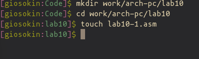{ #fig:111 width=70% }

## Листинг с примером выполнение подпрограммы

Скопируем листинг 10.1 и запустим его

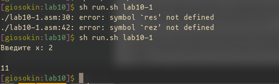{ #fig:002 width=70% }

Видим, что программа исполняется с ошибкой. 

### Исправление листинга

Найдем ошибки в коде и исправим их.

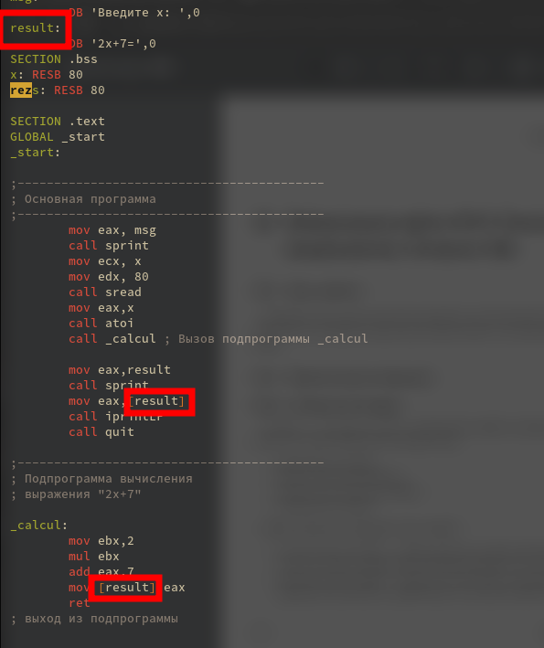{ #fig:001 width=70% }

Запустим код заново и проверим его

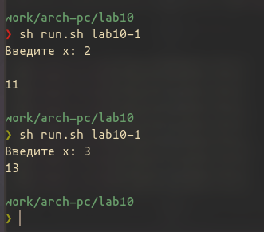{ #fig:044 width=70% }

Как видим, теперь код выполняется ожидаемо.

Добавим вниз кода подпрограмму

```nasm
  34    ;------------------------------------------
  35    ; Подпрограмма вычисления
  36    ; выражения "2x+7"
  37    
  38    _calcul:
  39        call _subcalcul
  40        mov ebx,2
  41        mul ebx
  42        add eax,7
  43        mov [result],eax
  44        ret
  45    ; выход из подпрограммы
  ```
  
  Испполним его и посмотрим на результат 

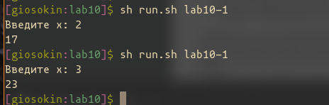{ #fig:004 width=70% }

## Отладка программы через GDB

Введем в файл `lab10-2.asm` код из листинга 10.2

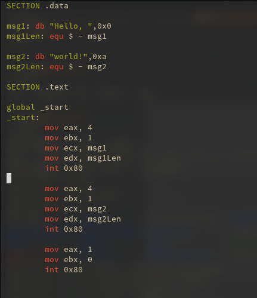{ #fig:005 width=70% }

Создадим баш скрипт `gen_debug.sh` что б дальше было удобнее работать с созданием исполняемых файлов с отладочной информацией

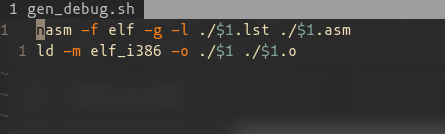{ #fig:006 width=70% }

Создадим с помощью этого скрипта исполняемый файл и откроем его через gdb введя `gdb lab10-2`

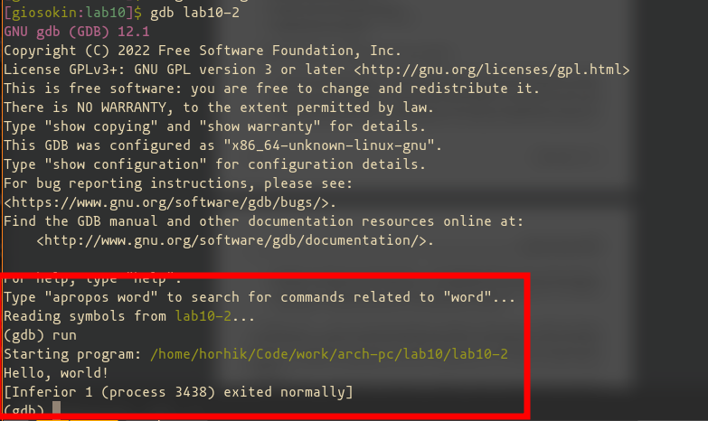{ #fig:007 width=70% }

Запустим `run` и увидим, что код исполнился и вывел `Hello world` на экран.

### Точка остановы

Поставим отчку остановы на метке `_start` и запустим программу

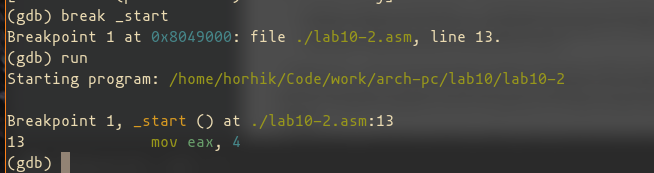{ #fig:008 width=70% }

Исполнение программы остановилось на метке `_start`

### Вывод дисассемблированного кода в формате Intel

Выведем дизассемблированный код программы

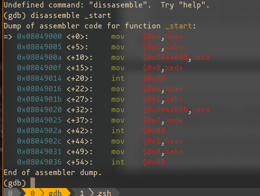{ #fig:009 width=70% }

Выведенный дизассемблированный код в формате AT&T 

Изменим его на формат отображение от Intel

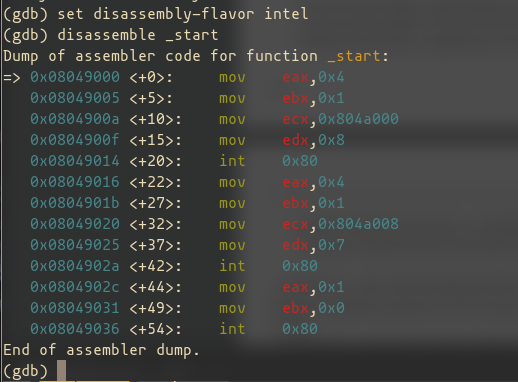{ #fig:010 width=70% }

### GDB TUI

Включи режим псевдографики.

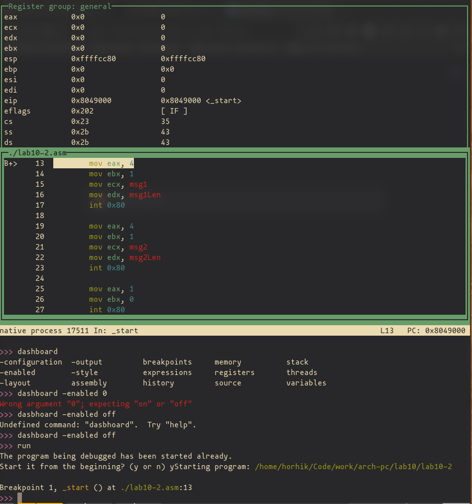{ #fig:011 width=70% }

Также, мы можем переключаться между этими режимами, нажимая `Ctrl+a Ctrl+a`

### Точка остановы по адресу

Поставим точку остановы на адресс `0x8049031`

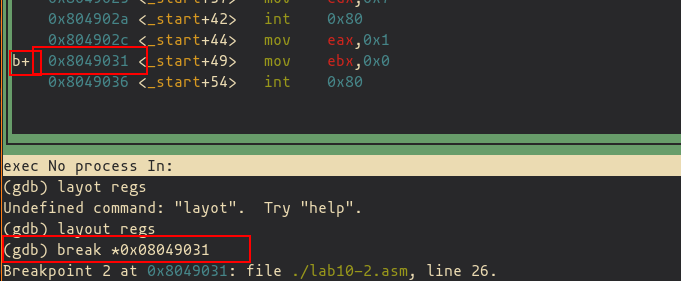{ #fig:012 width=70% }

Выведем информацию о поставленных точках остановы

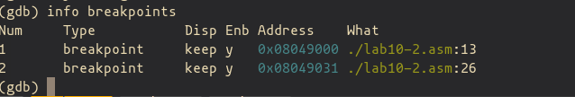{ #fig:013 width=70% }

Можем вывести информацию более короткой коммандой `i b`

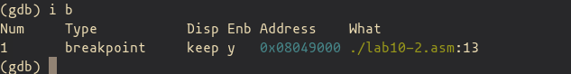{ #fig:014 width=70% }

### Просмотр содержимого регистров

Запустим программу заново и исполним комманду `si` 5 раз, наблюдая как меняются регистры. 


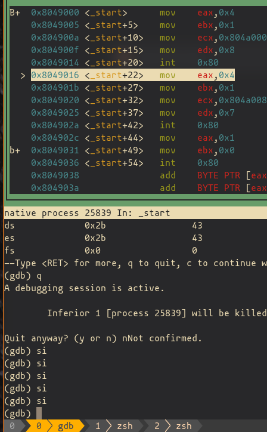{ #fig:015 width=70% }

В конце мы видим, что в `eax`, `ebx`, `ecx` и `edx` уже не нулевые значения. 

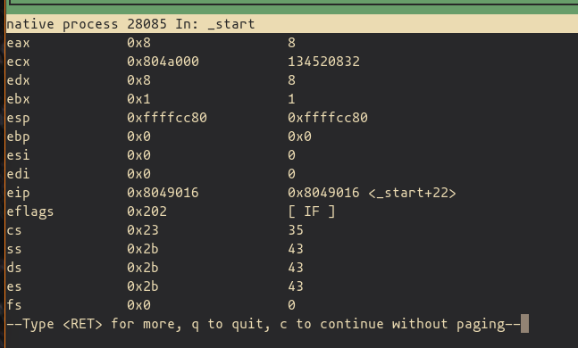{ #fig:016 width=70% }


Введем `x/1sb &msg1` что бы посмотреть, какие данные лежат в `msg1`

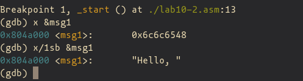{ #fig:017 width=70% }

ПРосмотрим содержимое `&msg2` указав его аддрес в памяти

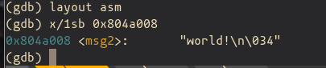{ #fig:018 width=70% }

Просмотрим содержимое инструкции `mov ecx, msg2`, находящейся по адрессу `0x8049020`

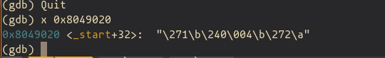{ #fig:019 width=70% }

### Изменение значений в памяти 

Изменим значение в `msg1`

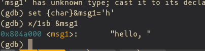{ #fig:020 width=70% }

У нас меняется только первая буква, потому что меняется только первый байт

Заменим две буквы в переменной `&msg2`

Мы сдвигаемся на один байт, поэтому +1

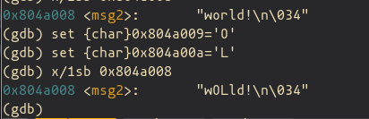{ #fig:021 width=70% }

### Просмотр значений регистров

Запустим программу заново и просмотрим как меняется регистр  eax и выведем значение регистра. 

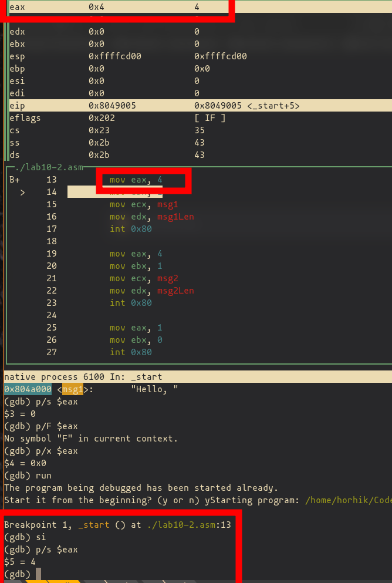{ #fig:022 width=70% }

Прсмотрим как меняется регистр edx и сделаем вывод в нескольких фоматах

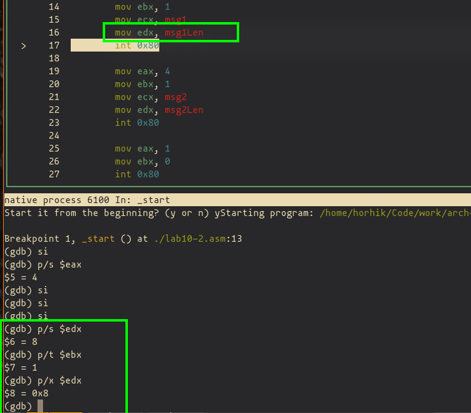{ #fig:023 width=70% }

### Изменение значений регистров

Изменим значение регистра ebx с помощью коммагды `set`

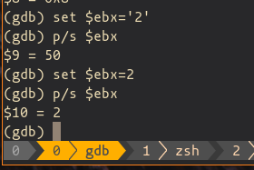{ #fig:024 width=70% }

Вывод разный, потому что в первом случае мы выводим не число два, а код числа два в таблице ASCII

### Завершение программы

Введем `c` что бы продолжить выполнение программы. 


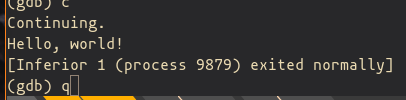{ #fig:025 width=70% }

Программа завершила свое выполнение. Можем выйти, нажав `q`

## Обработка аргументов коммандной строки


Скопируем файл `lab9-2.asm`  в `lab10-4.asm`

Откроем этот файл в gdb с флагом аргументов

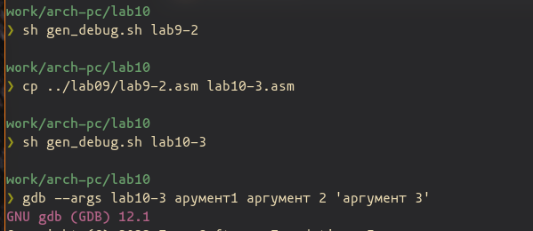{ #fig:026 width=70% }

Поставим точку остановы

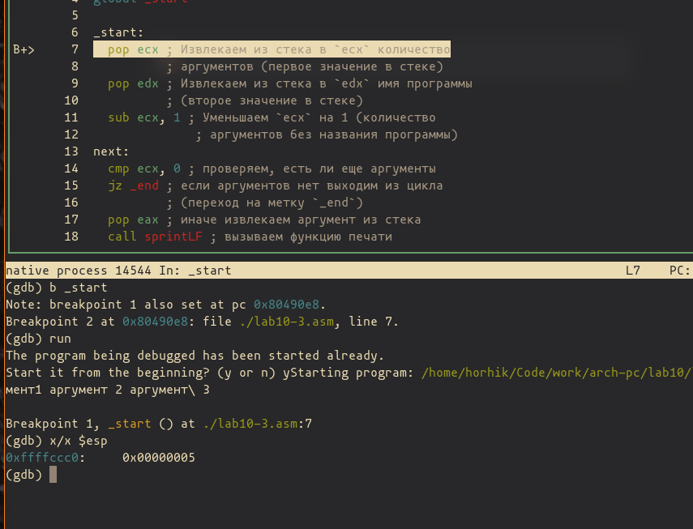{ #fig:027 width=70% }

Запустим и выведем значение регистра `esp`.

После выведем все введенные аргументы`

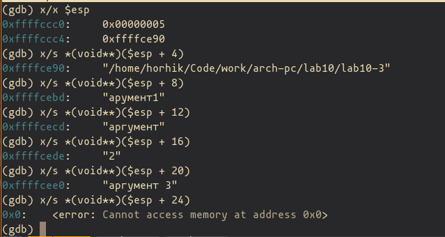{ #fig:028 width=70% }

Как видем, когда аргументы закончились, вывелась ошибка

Шаг изменения адресса равен 4, потому что столько места зарезервированно на стеке на указатель введенного аргумента


# Задания для самостоятельной работы

## Вычисление значения функции как подпрограмма

В 9 лабораторной я уже выделил эту функцию как подпрограмму. Был создан файл `my-function.asm`

```nasm
   1    ; f(x) = 17 + 5x
   2    ; eax = x
   3    ; eax = res
   4    magic_function:
   5    
   6      push ebx
   7      push ecx
   8      push edx
   9    
  10      mov ecx,5
  11      mul ecx
  12      add eax, 17
  13    
  14      pop edx
  15      pop ecx
  16      pop ebx
  17    
  18    
  19      ret
  20    
  21    
```

Вызов этой функции в файле `lab9-4.asm`

```nasm
  30      call atoi ; преобразуем символ в число
  31   
  32   
  33      call magic_function
  34   
  35      add esi,eax ; добавляем к промежуточной сумме
  36   
```

## Анализ программы с сошибкой


Запустим код программы через GDB. 

Так как умножение происходит в регистр EAX, будем ожидать, что перед умножением в EAX должно лежать `(3+2) = 5`

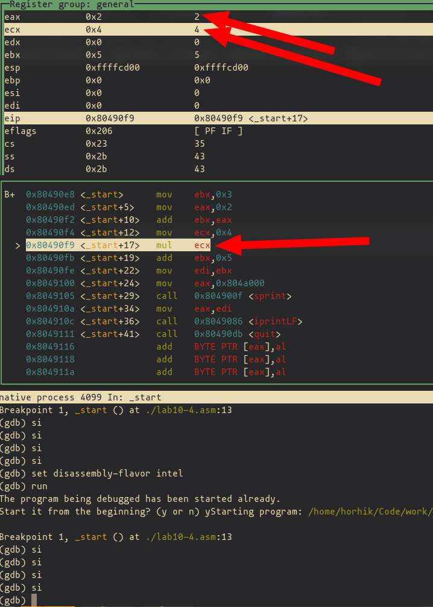{ #fig:029 width=70% }

Как видим, в EAX не 5

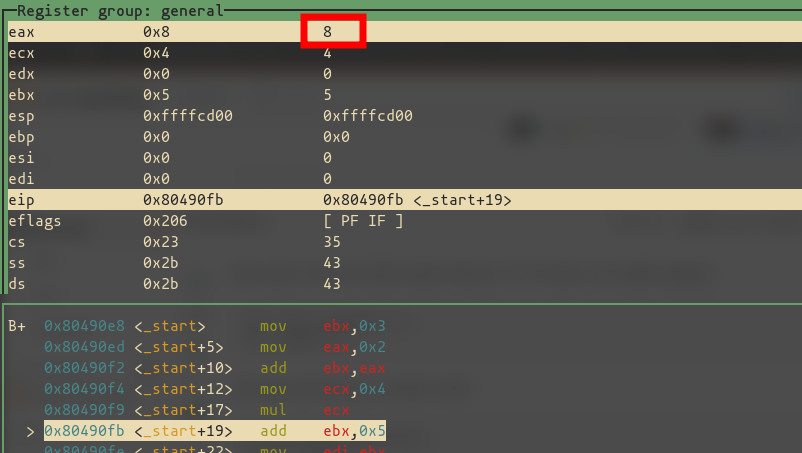{ #fig:030 width=70% }

$2*4 = 8$

Вычисление не те, потому что мы перемещаем в EAX 2 и после ничего с ним не делаем. 

Мы можем заметить, что нам нужно изменить срочку со сложением `ecx, eax` на `eax, ecx`, что бы результат сложения хранился в EAX.

{ #fig:031 width=70% }

Запустим заново

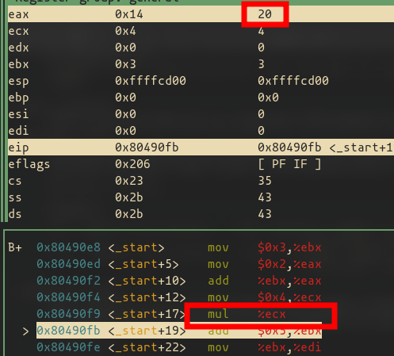{ #fig:032 width=70% }

Как видим, теперь результат верный

Продолжим дебажить. 

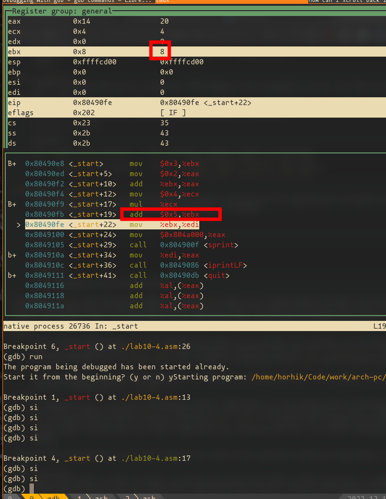{ #fig:033 width=70% }

Как мы видим, число 5 добавилось в регистр EBX, а не в EAX. 

А после это значение переносится в EDI. Обычно этот регист отвечает за ввод. 

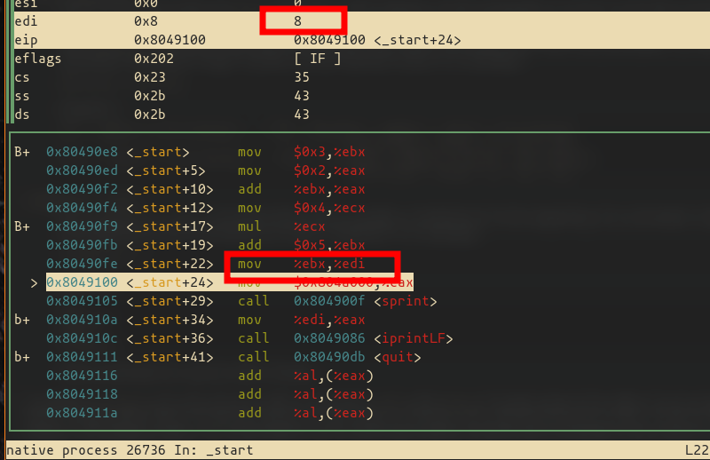{ #fig:034 width=70% }

 После  Содержимое EDI выводится на экран, поэтому следует предположить, что добавление $5$ к регистру EBX, а не к EAX - не то поведение программы, которое мы ожидаем. 


Изменим программу, заменим ebx на eax.

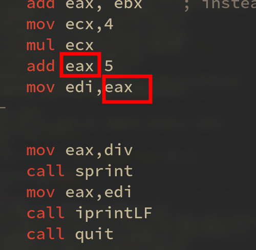{ #fig:035 width=70% }


Запустим программу заново и посмотрим как теперь изменилось ее поведение.

Исполним continue, пропустив все точки остановы. На экран выводится 25 - ожидаемый результат

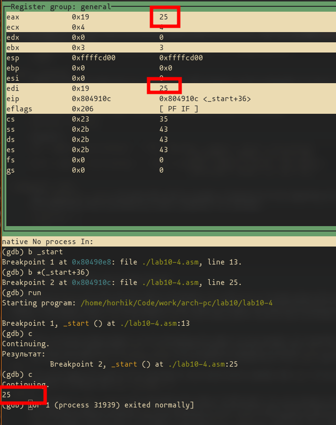{ #fig:036 width=70% }

Теперь запустим программу не через GDB

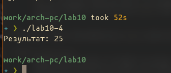{ #fig:037 width=70% }

Вывелся правильный результат. 


# Выводы

Мы приобрели навыки написания программ с использованием подпрограмм а также ознакомились с процессом отладки через программу GDB и научились пользоваться его основными возможностями.

