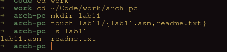
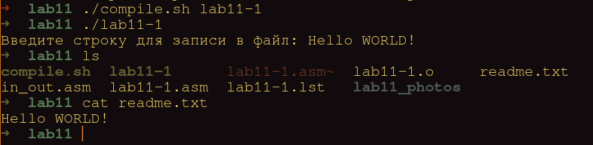
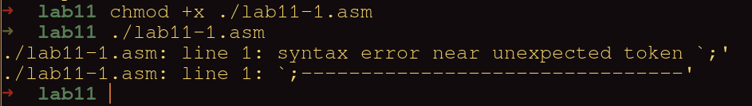
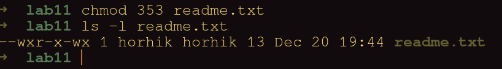
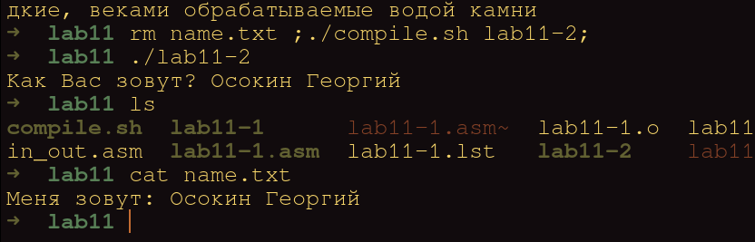

---
## Front matter
title: "Лабораторная работа №11. Работа с файлами средствами Nasm"
subtitle: "ДИсциплина: Архитектура ЭВМ"
author: "Осокин Георгий Иванович НММбд-02-22"

## Generic otions
lang: ru-RU
toc-title: "Содержание"

## Bibliography
bibliography: bib/cite.bib
csl: pandoc/csl/gost-r-7-0-5-2008-numeric.csl

## Pdf output format
toc: true # Table of contents
toc-depth: 2
lof: true # List of figures
lot: true # List of tables
fontsize: 12pt
linestretch: 1.5
papersize: a4
documentclass: scrreprt
## I18n polyglossia
polyglossia-lang:
  name: russian
  options:
	- spelling=modern
	- babelshorthands=true
polyglossia-otherlangs:
  name: english
## I18n babel
babel-lang: russian
babel-otherlangs: english
## Fonts
mainfont: PT Serif
romanfont: PT Serif
sansfont: PT Sans
monofont: PT Mono
mainfontoptions: Ligatures=TeX
romanfontoptions: Ligatures=TeX
sansfontoptions: Ligatures=TeX,Scale=MatchLowercase
monofontoptions: Scale=MatchLowercase,Scale=0.9
## Biblatex
biblatex: true
biblio-style: "gost-numeric"
biblatexoptions:
  - parentracker=true
  - backend=biber
  - hyperref=auto
  - language=auto
  - autolang=other*
  - citestyle=gost-numeric
## Pandoc-crossref LaTeX customization
figureTitle: "Рис."
tableTitle: "Таблица"
listingTitle: "Листинг"
lofTitle: "Список иллюстраций"
lotTitle: "Список таблиц"
lolTitle: "Листинги"
## Misc options
indent: true
header-includes:
  - \usepackage{indentfirst}
  - \usepackage{float} # keep figures where there are in the text
  - \floatplacement{figure}{H} # keep figures where there are in the text
---

# Цель работы

Приобретение навыков написания программ для работы с файлами.

# Выполнение лабораторной работы

Создадим каталог с файлами `lab11.asm` и `readme.md`

{ #fig:001 width=70% }

Введем исходный текст из листинга 11.1

```nasm
;--------------------------------
; Запись в файл строки введененой на запрос
;--------------------------------
%include 'in_out.asm'
SECTION .data
filename db 'readme.txt', 0h ; Имя файла
msg db 'Введите строку для записи в файл: ', 0h ; Сообщение

SECTION .bss
contents resb 255 ; переменная для вводимой строки

SECTION .text
global _start
_start:

; --- Печать сообщения `msg`
	mov eax,msg
	call sprint

; ---- Запись введеной с клавиатуры строки в `contents`
	mov ecx, contents
	mov edx, 255
	call sread

; --- Открытие существующего файла (`sys_open`)
	mov ecx, 2 ; открываем для записи (2)
	mov ebx, filename
	mov eax, 5
	int 80h

				; --- Запись дескриптора файла в `esi`

	mov esi, eax 		; --- Расчет длины введенной строки
	mov eax, contents 	; в `eax` запишется количество
	call slen  		; введенных байтов
; --- Записываем в файл `contents` (`sys_write`)
	mov edx, eax
	mov ecx, contents
	mov ebx, esi
	mov eax, 4
	int 80h

; --- Закрываем файл (`sys_close`)
	mov ebx, esi
	mov eax, 6
	int 80h
	
	call quit

```

Создадим исполняемый файл и запустим его.
Выведем содержимое `readme.txt` на экран.

{ #fig:002 width=70% }

## Запретим исполнение файлу `./lab11-1`

Сделаем это с помощью комманды `chmod -x ./lab11-1`

{ #fig:003 width=70% }

Как видим, при попытке исполнить файл, на экран выводится "permission denied"

## Разрешим исполнение файлу `./lab11-1.asm`

Сделаем это коммандой `chmod +x ./lab11-1.asm`

Попробуем исполнить  этот файл. 

{ #fig:004 width=70% }

Программная оболочка "bash" пытается его исполнить, но воспринимает точку с запятой как комманду и не понимает ее.

## Изменение доступа к `readme.txt`

Так как наш вариант - 18, назначим файлу `readme.txt` права 
 
`-wx -r-x -wx = 353` 

В восьмеричной системе, это выглядит как 353


{ #fig:005 width=70% }

Проверим коммандной `ls -l`

# Задание для самостоятельной работы

Напишем программу, которая будет принимать наше имя из коммандной строки и записывать результат в файл `name.txt`

```nasm
%include 'in_out.asm'

SECTION .data
filename db 'name.txt', 0h
msg db 'Как Вас зовут? ', 0h
initial_text db 'Меня зовут: ', 0h

SECTION .bss
;;;  Note that content follows by `initial_text` that allows us not to concatinate string, but just reading farther by initial_text and getting context of the `content`
content resb 512

SECTION .text
global _start
_start:	
;;; PRINT msg 
	mov eax, msg 
	call sprint
;;; TAKING INPUT
	mov ecx, content
	mov edx, 512
	call sread

;;; CREATING FILE 

	mov ebx, filename
	mov ecx, 0777o 		; read and write for all, rwx for owner
	mov eax, 8
	int 80h

;;; OPENING FILE
	mov ecx, 2
	mov ebx, filename
	mov eax, 5
	int 80h

;;; WRITING INTO FILE

	mov esi, eax


;; Counting len of initial_len
	mov eax, initial_text  	; Len of initial_text to eax
	call slen 
	mov edx, eax		; edx = len(initial_text)
;;; Counting len of content
	mov eax, content  	; Len of content to eax
	call slen 
;;; Summing lens
	add edx, eax		; edx = len(initial_text) + len(content)
	add edx, 3		; to get terminate symbol


	mov ecx, initial_text   ; adding text to print
	mov ebx, esi 		; Moving descriptor of file above to EBX
	mov eax, 4
	int 80h

;;;  Quit
 	
	mov ebx, esi
	mov eax, 6
	int 80h

	call quit
	
	
```

Вместо использования `sys_leek`  мы можем инициализировать область памяти для введенного сообщеения после инициализации переменной `initial_text` таким образом, если мы вначале введем текст, а потом введем в файл значение из `initial_text` указав его длину большей на длину введенной строки. Тогда мы зайдем на область памяти  `content` и выведем и ее на экран. Благодоря этому мы можем вывести изначальный текст и введенный за одно действие.

Запустим программу и проверим ее результат. 

{ #fig:006 width=70% }

Как видим, программа работает корректно и добавляет в файл введенную строку. 


# Выводы

Мы приобрели навыки написания программ для работы с файлами и написали программу коорая добавляет в файл введенный текст.
